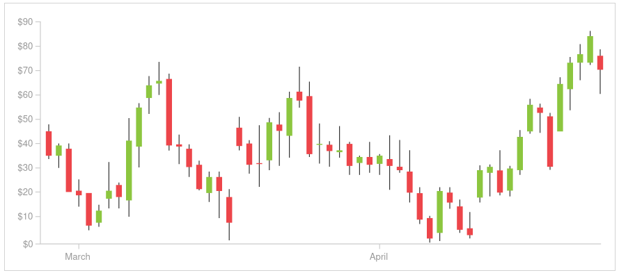
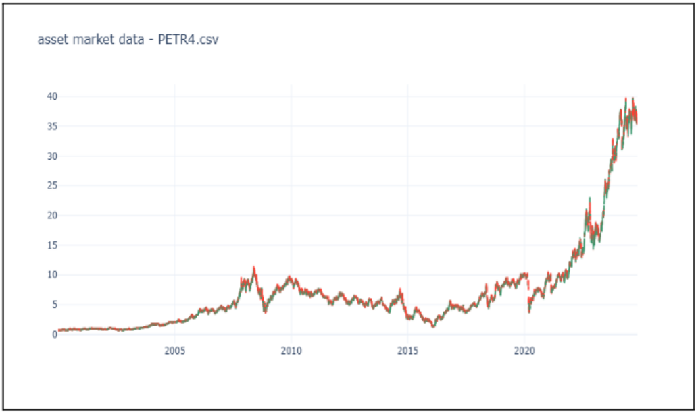
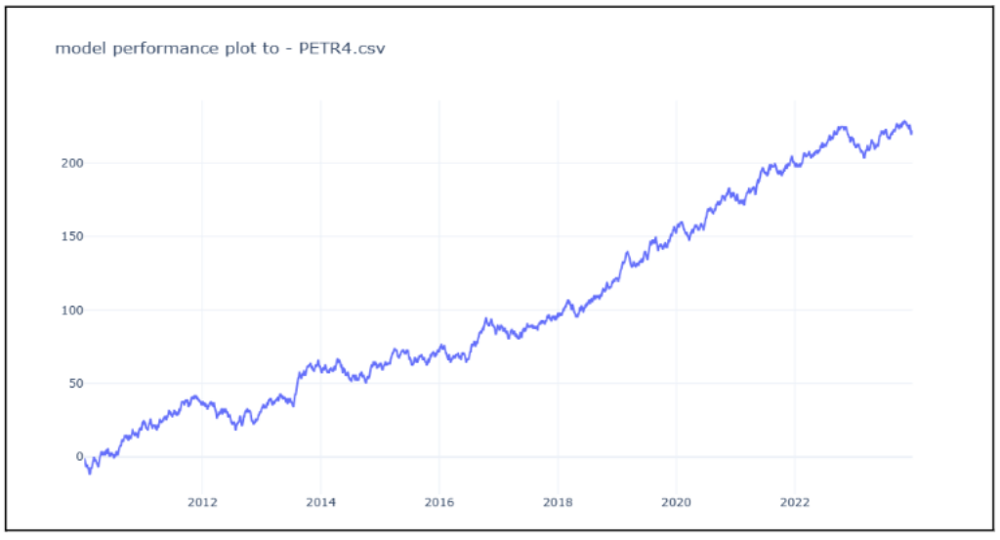
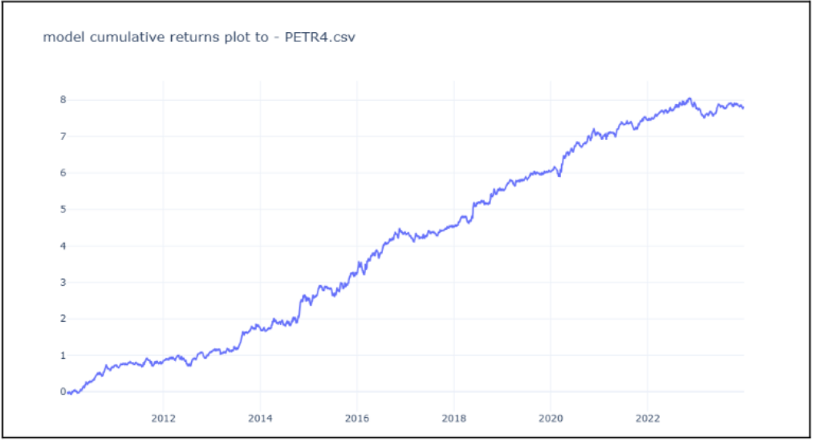

<div align="center">
  
</div>

# **Forecasting Upward and Downward Movements in Petrobras Stock Using Machine Learning**
> In this repository, we apply **Machine Learning** techniques to predict the directional behavior of **Petrobras (PETR4)** daily returns. A rolling-window framework is used to train, evaluate, and deploy multiple classification models, including **Logistic Regression, SVC, Gradient Boosting, and K-Nearest Neighbors**, generating sequential out-of-sample predictions from **2010 to 2023**. The resulting predictions are evaluated through classification metrics and a financial backtest to investigate their predictive and economic performance.

## Research Question
Can classical machine learning models extract predictive information from historical PETR4 market data to classify the direction of the next daily return?
Rather than evaluating models using a single static train/test split, this project uses a **rolling-window framework** that repeatedly trains, evaluates, selects, and deploys models as new market data become available.
The research investigates three main questions:

1. Can directional information be extracted from historical PETR4 data?
2. How stable is model performance across different market periods?
3. Does the resulting directional signal translate into economically meaningful out-of-sample performance?

## Experimental Setup
The experiment investigates the prediction of the directional behavior of Petrobras (PETR4) daily stock returns using Machine Learning techniques. The framework is designed to provide a reproducible and realistic evaluation through sequential out-of-sample predictions.

### Overview of the Experimental Framework
The experimental framework consists of the following stages:
- Historical data collection
- Data preprocessing and return computation
- Target Labeling
- Machine Learning pipeline
- Model evaluation and selection
- Out-of-sample production

### Data Collection
The dataset consists of daily OHLC price data for Petrobras (PETR4), traded on B3, covering the period from 2010 to 2023.
Data were obtained through the TradingView API and validated before analysis to ensure consistency and reliability.

<div align="center">
  
  <p align="center"><strong style="font-size: small;">Figure 1. Asset Market Data.</strong></p>
</div>

### Target Labeling
Daily returns were computed from consecutive closing prices:

$$
r_t = \frac{P_t-P_{t-1}}{P_{t-1}}\times100
$$

Returns were then categorized into two classes:

- **+1:** positive return
- **−1:** non-positive return

This transforms the problem into a binary classification task.

### Rolling Window Framework
A rolling window (roll-forward) framework was employed to simulate sequential model deployment under evolving market conditions.

Each window consists of two phases:

- **Development Phase:** training and testing of candidate models.
- **Production Phase:** out-of-sample prediction using the selected model.

The development period spans approximately ten years, followed by a twelve-month production period. After each production period, the window advances and the process is repeated, generating sequential out-of-sample evaluations from 2010 to 2023.

<div align="center">
  <p><strong>Table 1. Conceptual illustration of the rolling window approach</strong></p>

  <table>
    <tr>
      <th>Window</th>
      <th>Development Period (Train/Test)</th>
      <th>Production Period</th>
    </tr>
    <tr>
      <td>1</td>
      <td>2000–2009</td>
      <td>2010</td>
    </tr>
    <tr>
      <td>2</td>
      <td>2001–2010</td>
      <td>2011</td>
    </tr>
    <tr>
      <td>3</td>
      <td>2002–2011</td>
      <td>2012</td>
    </tr>
    <tr>
      <td>4</td>
      <td>2003–2012</td>
      <td>2013</td>
    </tr>
  </table>
</div>


### Machine Learning Pipeline
The Machine Learning pipeline was implemented in Python using pandas, numpy, and scikit-learn, following principles inspired by the CRISP-DM framework, the main stages are:

- **Load Database:** Load OHLC data and categorized returns.
- **Compute Output Feature:** Define the one-period-ahead categorized return.
- **Compute Input Features:** Generate technical and statistical features, including proprietary indicators.
- **Model Configuration:** Load modeling parameters from `modeling_arguments.json`.
- **Model Training:** Train multiple classification models.
- **Model Evaluation:** Evaluate models on training and testing datasets.
- **Model Selection:** Select the best-performing model according to the evaluation metrics.
- **Production Deployment:** Save the selected model and generate out-of-sample predictions.

### Classification Models

The following Machine Learning classifiers were evaluated within each rolling window:

- Logistic Regression
- Support Vector Classifier (SVC)
- K-Nearest Neighbors (KNN)
- Gradient Boosting Classifier

### Classification Metrics

Model performance was evaluated using the following classification metrics:

**Accuracy**

$$
\mathrm{Accuracy} = \frac{TP + TN}{TP + TN + FP + FN}
$$

**Precision**

$$
\mathrm{Precision} = \frac{TP}{TP + FP}
$$

**Recall**

$$
\mathrm{Recall} = \frac{TP}{TP + FN}
$$

where $TP$, $TN$, $FP$, and $FN$ denote true positives, true negatives, false positives, and false negatives, respectively.
 
> Obs: The selected model was subsequently stored and used during the production phase, with continuous monitoring of its performance.


## Results

### Production Classification Performance
A total of fourteen Machine Learning models were deployed in production from 2010 to 2023 using the rolling window framework described in the previous section. Table 2 summarizes the classification accuracy achieved by each selected model during the training, testing, and production phases. Overall, thirteen out of the fourteen deployed models achieved production accuracy above 50%, resulting in an average production accuracy of approximately 53%. This indicates that 92% of the implementations exceeded a random baseline over the fourteen-year evaluation period.

Logistic Regression achieved production accuracy ranging from 52.6% to 54.7%, with relatively stable performance across training, testing, and production phases. The results show limited differences between in-sample and out-of-sample performance, indicating a comparatively stable behavior across the rolling windows.

The K-Nearest Neighbors (KNN) classifier demonstrated consistent performance across the evaluation phases, with production accuracy ranging from approximately 50.8% to 56.1%. KNN achieved some of the highest production accuracy values among the evaluated models while maintaining relatively stable performance across different rolling windows.

The Gradient Boosting Classifier exhibited strong in-sample performance, with training accuracy reaching values as high as 74.2%. However, production accuracy varied considerably, ranging from 49.1% to 55.1%. This degradation between training and production performance suggests potential overfitting and sensitivity to regime changes in the data.

The Support Vector Classifier (SVC) showed more modest and stable performance, with production accuracy ranging from 51.6% to 53.4%. However, discrepancies between training and production accuracy indicate a degree of sensitivity to data distribution shifts across rolling windows.

<div align="center">
  <p><strong>Table 2. Classification accuracy of models across rolling windows</strong></p>

  <table>
    <tr>
      <th>Research ID</th>
      <th>Model Type</th>
      <th>Production Accuracy (%)</th>
      <th>Test Accuracy (%)</th>
      <th>Train Accuracy (%)</th>
    </tr>
    <tr><td>Research 1</td><td>Logistic Regression</td><td>54.66</td><td>52.44</td><td>53.86</td></tr>
    <tr><td>Research 2</td><td>Logistic Regression</td><td>52.61</td><td>51.81</td><td>54.44</td></tr>
    <tr><td>Research 3</td><td>Gradient Boosting Classifier</td><td>49.19</td><td>51.81</td><td>68.46</td></tr>
    <tr><td>Research 4</td><td>K-Nearest Neighbors</td><td>55.65</td><td>54.03</td><td>68.48</td></tr>
    <tr><td>Research 5</td><td>K-Nearest Neighbors</td><td>50.81</td><td>52.73</td><td>69.83</td></tr>
    <tr><td>Research 6</td><td>Gradient Boosting Classifier</td><td>51.63</td><td>52.12</td><td>72.45</td></tr>
    <tr><td>Research 7</td><td>Support Vector Classifier</td><td>53.41</td><td>51.82</td><td>52.83</td></tr>
    <tr><td>Research 8</td><td>Support Vector Classifier</td><td>51.63</td><td>54.75</td><td>51.77</td></tr>
    <tr><td>Research 9</td><td>Gradient Boosting Classifier</td><td>55.10</td><td>52.93</td><td>74.18</td></tr>
    <tr><td>Research 10</td><td>K-Nearest Neighbors</td><td>56.05</td><td>52.43</td><td>68.62</td></tr>
    <tr><td>Research 11</td><td>Logistic Regression</td><td>54.62</td><td>52.32</td><td>52.45</td></tr>
    <tr><td>Research 12</td><td>K-Nearest Neighbors</td><td>54.66</td><td>56.97</td><td>69.18</td></tr>
    <tr><td>Research 13</td><td>Gradient Boosting Classifier</td><td>53.20</td><td>55.76</td><td>71.42</td></tr>
    <tr><td>Research 14</td><td>Support Vector Classifier</td><td>51.61</td><td>54.03</td><td>53.03</td></tr>
  </table>

  <p><em>Production accuracy indicates a degree of sensitivity to data distribution shifts across rolling windows.</em></p>
</div>


### Average Classification Metrics
To provide a comprehensive evaluation, Table 3 reports the average classification metrics across all production windows, including accuracy, precision, and recall for both downward and upward return classes. The overall average accuracy was **53.20%**, with precision of **52.41%** and recall of **48.67%** for downward movements, and precision of **53.79%** and recall of **57.43%** for upward movements.

For the **downward class**, the average precision was **52.41%**, indicating that approximately 52% of the predicted downward movements were correctly classified. The recall was lower, at **48.67%**, suggesting that a substantial proportion of actual downward movements were not identified.

For the **upward class**, the average precision reached **53.79%**, while recall was **57.43%**, indicating a stronger ability to identify positive return movements. These results suggest a mild predictive bias toward upward movements, which is commonly observed in equity market prediction tasks due to the long-term positive drift in stock prices.

<div align="center">
  <p><strong>Table 3. Average classification performance metrics across all rolling windows</strong></p>

  <table>
    <tr>
      <th>Metric</th>
      <th>Average Value (%)</th>
    </tr>
    <tr>
      <td>Accuracy</td>
      <td>53.20</td>
    </tr>
    <tr>
      <td>Precision (Down)</td>
      <td>52.41</td>
    </tr>
    <tr>
      <td>Recall (Down)</td>
      <td>48.67</td>
    </tr>
    <tr>
      <td>Precision (Up)</td>
      <td>53.79</td>
    </tr>
    <tr>
      <td>Recall (Up)</td>
      <td>57.43</td>
    </tr>
  </table>
</div>


### Cumulative Performance Analysis
A cumulative scoring approach was used to assess model performance over time, assigning **+1** to correct predictions and **−1** to incorrect predictions. The resulting cumulative performance curve illustrates the long-term consistency of the predictions.

<div align="center">
  
  <p align="center"><strong>Figure 2. Cumulative performance of correct and incorrect predictions from 2010 to 2023.</strong></p>
</div>

Cumulative financial returns were also computed based on the model's directional signals, assuming a transaction cost of **0.05% per operation** and no stop-loss mechanism. The cumulative return trajectory reflects the financial performance of the modeling strategy over the evaluation period.

<div align="center">
  
  <p align="center"><strong>Figure 3. Cumulative financial returns from 2010 to 2023.</strong></p>
</div>

### Annual Return Comparison
To enable a clearer comparison with the underlying asset, cumulative returns were aggregated on an annual basis and contrasted with the annual returns of Petrobras (PETR4). Table 4 presents the results for the period from 2010 to 2023.

The analysis reveals that the modeling strategy generally outperformed the asset during years of negative or adverse market conditions. In years such as 2010, 2011, 2014, and 2015, when PETR4 experienced substantial losses, the modeling approach maintained positive or significantly less negative returns. A notable example is 2016, in which the model achieved an annual return of approximately **89.4%**, while PETR4 returned **95.1%**.

Conversely, during years of strong asset appreciation, the modeling strategy did not fully capture the magnitude of the asset's upward movements. In 2023, for instance, PETR4 delivered an annual return of **79.8%**, while the modeling strategy produced a comparatively modest return of **2.15%**.

These findings suggest that the proposed modeling framework is particularly effective during periods of market stress or heightened uncertainty but may underperform in strongly bullish regimes.

<div align="center">
  <p><strong>Table 4. Annual percentage returns of the modeling strategy and PETR4 asset</strong></p>

  <table>
    <tr>
      <th>Year</th>
      <th>Modeling Returns (%)</th>
      <th>Asset Returns (%)</th>
    </tr>
    <tr><td>2010</td><td>50.51</td><td>-22.5</td></tr>
    <tr><td>2011</td><td>7.94</td><td>-14.3</td></tr>
    <tr><td>2012</td><td>19.91</td><td>-2.7</td></tr>
    <tr><td>2013</td><td>47.72</td><td>-6.2</td></tr>
    <tr><td>2014</td><td>65.44</td><td>-36.7</td></tr>
    <tr><td>2015</td><td>56.00</td><td>-13.9</td></tr>
    <tr><td>2016</td><td>89.44</td><td>95.1</td></tr>
    <tr><td>2017</td><td>14.29</td><td>18.2</td></tr>
    <tr><td>2018</td><td>74.36</td><td>54.6</td></tr>
    <tr><td>2019</td><td>32.75</td><td>31.7</td></tr>
    <tr><td>2020</td><td>77.44</td><td>18.1</td></tr>
    <tr><td>2021</td><td>29.07</td><td>30.5</td></tr>
    <tr><td>2022</td><td>30.62</td><td>36.0</td></tr>
    <tr><td>2023</td><td>2.15</td><td>79.8</td></tr>
  </table>
</div>

### Risk-Adjusted Performance
To further evaluate performance quality, risk-adjusted metrics were computed, including average return, volatility, and the Sharpe ratio. Table 5 summarizes the comparison between the modeling strategy and the PETR4 asset.

The modeling strategy achieved an average annual return of **42.69%**, compared with **19.12%** for the asset. The modeling approach also exhibited lower volatility (**27.43%**) compared to the asset (**38.69%**). The resulting Sharpe ratio was **1.08** for the modeling strategy and **0.16** for PETR4.

<div align="center">
  <p><strong>Table 5. Risk-adjusted performance comparison between the modeling strategy and PETR4</strong></p>

  <table>
    <tr>
      <th>Metric</th>
      <th>Modeling Strategy</th>
      <th>PETR4 Asset</th>
    </tr>
    <tr>
      <td>Average Return (%)</td>
      <td>42.69</td>
      <td>19.12</td>
    </tr>
    <tr>
      <td>Volatility (%)</td>
      <td>27.43</td>
      <td>38.69</td>
    </tr>
    <tr>
      <td>Sharpe Ratio</td>
      <td>1.08</td>
      <td>0.16</td>
    </tr>
  </table>
</div>


## Findings
- Fourteen Machine Learning models were deployed using the rolling window framework from 2010 to 2023.
- Most deployed models achieved production accuracy above 50%, with an average accuracy of approximately 53%.
- K-Nearest Neighbors (KNN) demonstrated the most stable performance across training, testing, and production phases.
- Gradient Boosting Classifier showed strong in-sample performance but deteriorated in production, indicating potential overfitting.
- Precision and recall indicated a stronger ability to identify upward movements than downward movements.
- The modeling strategy showed strong performance during adverse market conditions and market downturns.
- The strategy did not fully capture strong bullish rallies, resulting in lower performance during periods of sharp asset appreciation.
- The modeling strategy achieved higher risk-adjusted performance than the passive PETR4 benchmark, with a higher Sharpe ratio.


## Limitations and Future Work
- The model showed limitations in capturing strong upward market movements.
- The directional bias toward upward predictions may reduce the identification of downward movements.
- Gradient Boosting showed sensitivity to changes between training and production data.
- Future work may explore adaptive thresholding.
- Regime-aware models may be investigated to improve adaptation to changing market conditions.
- Alternative transaction cost structures may be evaluated.
- Future experiments may focus on improving performance during strong upward market trends.

## References
1. Tashman, L. J. (2000). *Out-of-sample tests of forecasting accuracy: An analysis and review*. International Journal of Forecasting, 16(4), 437–450.
2. Friedman, J. H. (2001). *Greedy function approximation: A gradient boosting machine*. The Annals of Statistics, 29(5), 1189–1232.
3. Cortes, C., & Vapnik, V. (1995). *Support-vector networks*. Machine Learning, 20(3), 273–297.
4. Cover, T. M., & Hart, P. E. (1967). *Nearest neighbor pattern classification*. IEEE Transactions on Information Theory, 13(1), 21–27.
5. Hosmer, D. W., Lemeshow, S., & Sturdivant, R. X. (2013). *Applied Logistic Regression*. Wiley.
6. Hull, J. C. (2018). *Options, Futures, and Other Derivatives*. Pearson.
7. Shearer, C. (2000). *The CRISP-DM model: The new blueprint for data mining*.

## Project Structure
```text
📦 quantyma-petr4-ml
┣ 📂 data
┣ 📂 images
┣ 📂 notebooks
┃ ┣ 📜 01-data-exploration.ipynb
┃ ┣ 📜 02-feature-engineering.ipynb
┃ ┣ 📜 03-model-development.ipynb
┃ ┣ 📜 04-rolling-window.ipynb
┃ ┗ 📜 05-backtesting.ipynb
┣ 📂 src
┃ ├ 📜 data.py
┃ ├ 📜 features.py
┃ ├ 📜 models.py
┃ ├ 📜 rolling_window.py
┃ └ 📜 backtest.py
┣ 📜 README.md
┣ 📜 requirements.txt
┗ 📜 LICENSE
```

## Reproducibility
Clone the repository and install the required dependencies:

```bash
git clone <repository-url>
cd <repository>
pip install -r requirements.txt
```

The notebooks reproduce the main stages of the research, from data processing and feature construction to model evaluation and backtesting.
